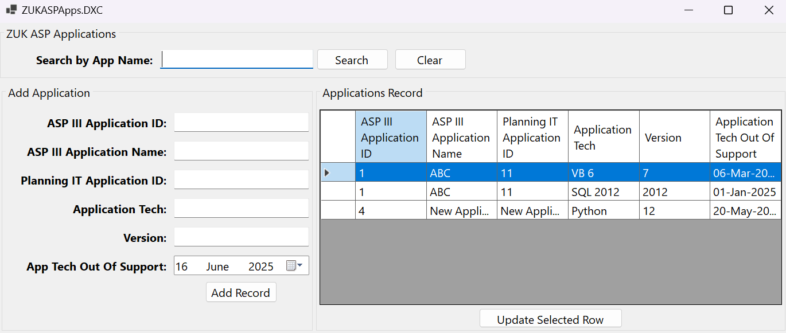
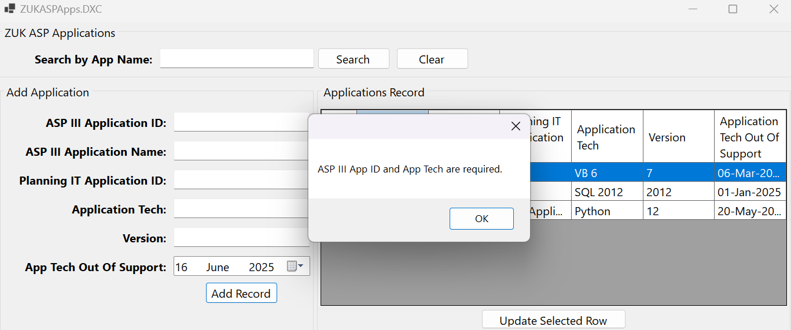
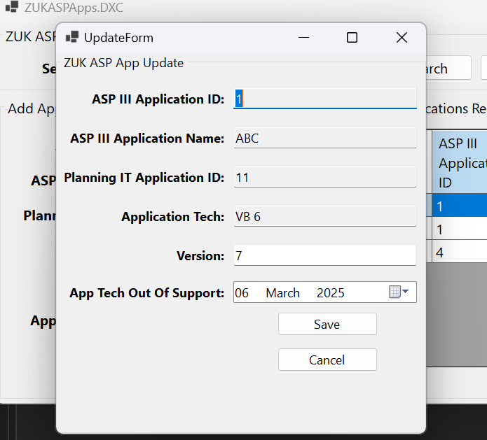

# App_Manager

App Manager is a desktop application developed using .NET and WinForms, designed to streamline and simplify management tasks, enhancing time efficiency. The application can be further extended to support the management of system software, providing greater functionality and scalability.

